# Java_Web_bbs

## 项目简介

基于BootStrap + Servlet3的BBS论坛系统

## 功能演示

### 主页

直接访问即可进入主页

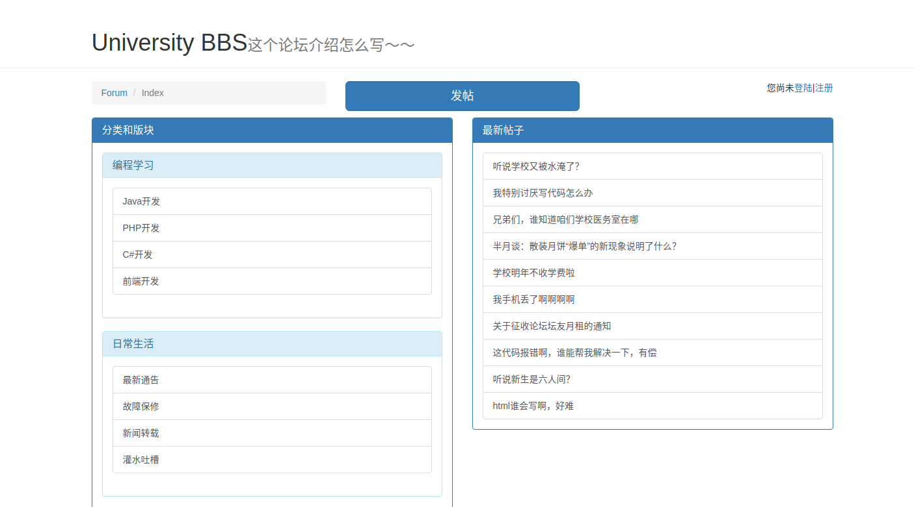

### 版块

主页左侧版块列表中的版块，即可进入版块，每10条帖子一页

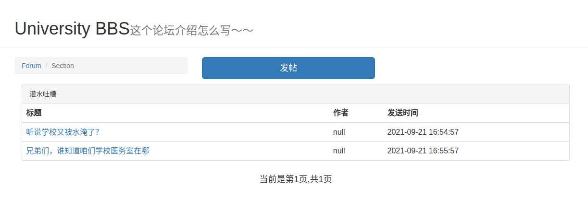

### 注册

点击右上角的注册，即可进入注册页面

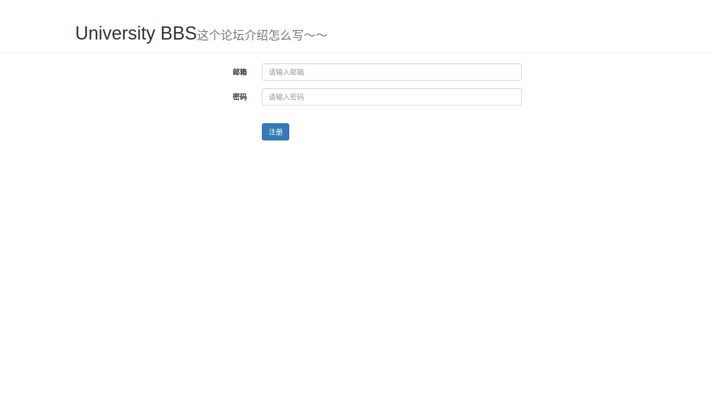

注册成功将跳转回主页进行登陆，注册时，后端将密码进行md5加密存入数据库

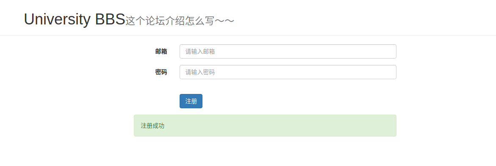

### 登陆

页面如图

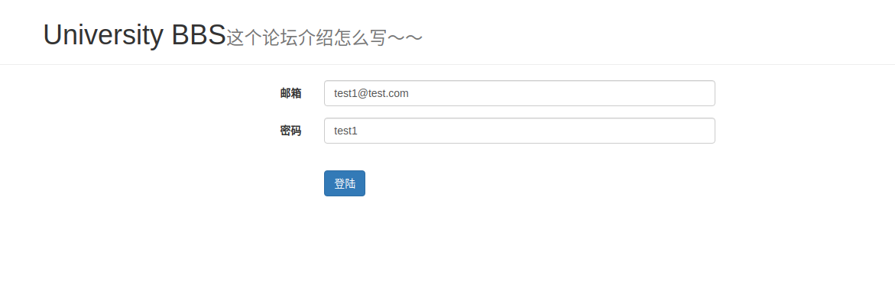

登陆成功后，会获取到名为userId的cookies,并且页面会识别到此cookie视为登陆状态

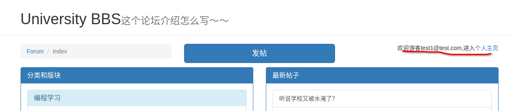

### 个人主页

登陆后，点击个人主页，即可进入主页，对自己的帖子和信息进行管理

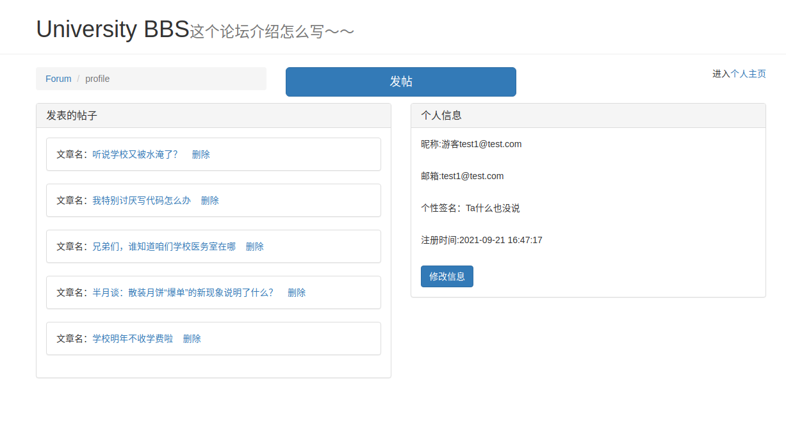

### 修改个人信息

登陆后进入个人主页，点击修改信息

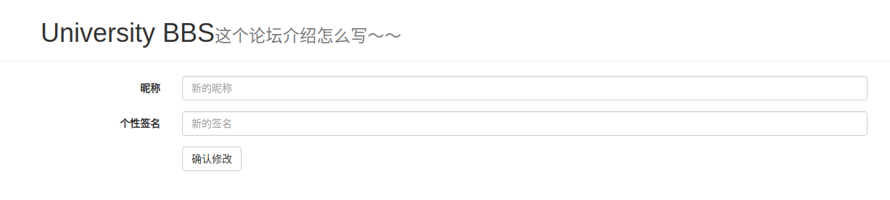

修改成功后，会如注册一样弹出绿色提示框，并跳转回个人主页

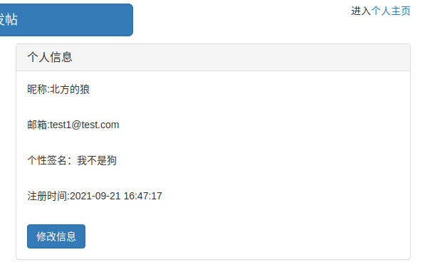

左侧可以直接删除自己的帖子，并且在此处做了cookie验证，当你访问别人的主页时，无修改和删除选项，防止平行越权

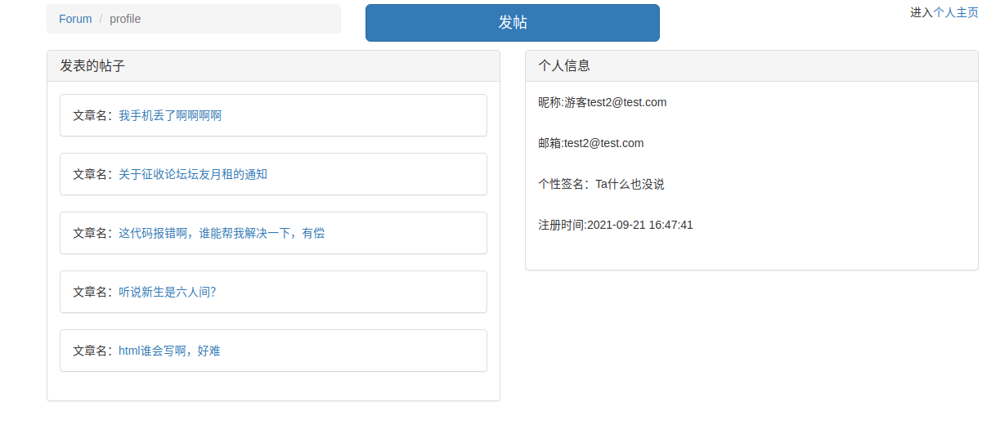

### 发帖

登陆后，点击发帖按钮进行发帖操作

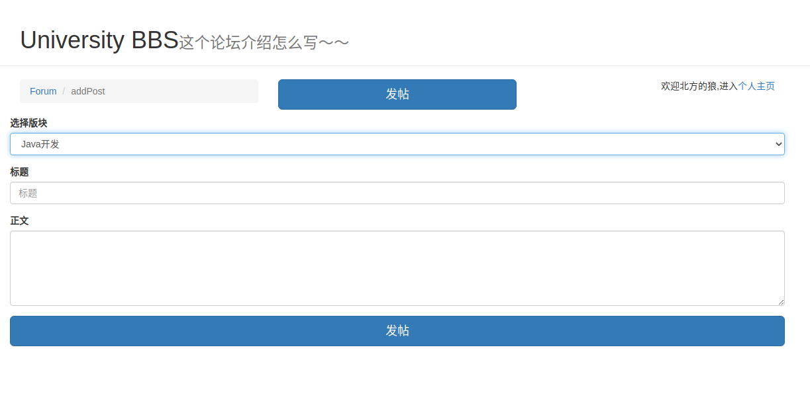

可以下拉版块列表选择版块

### 评论

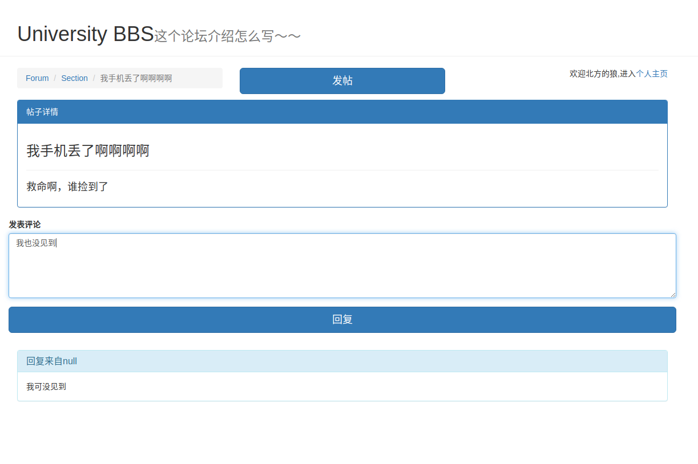

### 论坛管理

访问/manage进入管理界面

普通用户无权访问

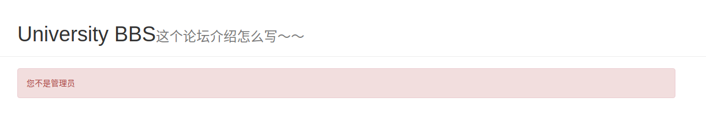

管理员账户登陆可以对论坛信息和所有帖子进行操作

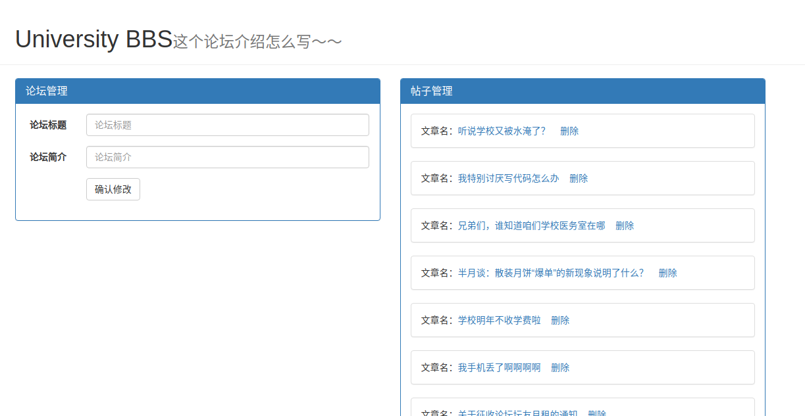

## 目前存在的问题

- 单独用Cookies验证用户，存在非常严重的越权漏洞，可以同时进行平行越权和垂直越权
- 帖子管理等位置ui交互不太对劲
- 预留了很多接口，比如说版主的管理员身份
- 没有搜索功能

# 数据库

### classify

| 字段       | 类型    | 说明                |
| ---------- | ------- | ------------------- |
| classifyId | int     | 主键，Auto increase |
| name       | varchar | 分类名称            |

### forum

| 字段         | 类型     | 说明     |
| ------------ | -------- | -------- |
| name         | varchar  | 论坛名称 |
| introduction | varchar  | 论坛简介 |
| createDate   | datetime | 建站时间 |

### manager
| 字段      | 类型 | 说明                              |
| --------- | ---- | --------------------------------- |
| managerId | int  | 主键，Auto increase               |
| userId    | int  | 外键，用户id                      |
| level     | int  | 管理员级别(0:版主，1:管理员)      |
| sectionId | int  | 外键，管理的版块id(为0则全部版块) |

### posts
| 字段      | 类型     | 说明                |
| --------- | -------- | ------------------- |
| postId    | int      | 主键，Auto increase |
| sectionId | int      | 外键，所属的版块id  |
| userId    | int      | 外键，发帖人id      |
| time      | datetime | 发送时间            |
| title     | varchar  | 帖子标题            |
| content   | varchar  | 帖子内容            |

### reply
| 字段      | 类型     | 说明                       |
| --------- | -------- | -------------------------- |
| replyId   | int      | 主键，Auto increase        |
| postId    | int      | 外键，回复的帖子的id       |
| userId    | int      | 外键，回复人的id           |
| content   | varchar  | 回复内容                   |
| time      | datetime | 回复时间                   |
| isReply   | int      | 是否是回复其他评论(0否1是) |
| toReplyId | int      | 回复的评论id               |

### section
| 字段       | 类型    | 说明                 |
| ---------- | ------- | -------------------- |
| sectionId  | int     | 版块Id,auto Increase |
| name       | varchar | 版块名称             |
| classifyId | int     | 外键，所属分类id     |

### users 

| 字段      | 类型     | 说明                |
| --------- | -------- | ------------------- |
| userId    | int      | 主键，Auto increase |
| nickname  | varchar  | 用户昵称            |
| email     | varchar  | 用户邮箱            |
| passwd    | varchar  | 密码                |
| signature | varchar  | 个性签名            |
| picture   | varchar  | 头像图片路径        |
| regTime   | datetime | 注册时间            |

